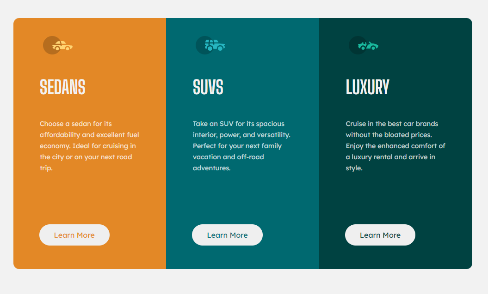

# Frontend Mentor - 3-column preview card component solution

This is a solution to the [3-column preview card component challenge on Frontend Mentor](https://www.frontendmentor.io/challenges/3column-preview-card-component-pH92eAR2-). Frontend Mentor challenges help you improve your coding skills by building realistic projects.

## Table of contents

- [Overview](#overview)
  - [The challenge](#the-challenge)
  - [Screenshot](#screenshot)
  - [Built with](#built-with)
  - [What I learned](#what-i-learned)
- [Author](#author)
- [Acknowledgments](#acknowledgments)

## Overview

### The challenge

Users should be able to:

- View the optimal layout depending on their device's screen size
- See hover states for interactive elements

### Screenshot

### Links

- Solution URL: [Front End Mentor Solution](https://www.frontendmentor.io/solutions/3columnpreviewcardcomponentmain-SmVdCp4Pw)
- Live Site URL: [Hosted on Github](https://chris971991.github.io/3-column-preview-card-component-main/)

## My process

### Built with

- Microsoft Edge
- VS Code
- Semantic HTML5 markup
- CSS custom properties
- Media Queries
- Flexbox
- SCSS (Sass)
- Mobile-first workflow

### What I learned

This challenge I learned how to use media queries to make the website dynamic and scale with the resoloution of the device in which the user is using. One major feat, was to make the image on the right appear on top when the screen is below a certain size.

## Author

- Website - [Christopher Carruthers](https://github.com/Chris971991)
- Frontend Mentor - [@carrumbum](https://www.frontendmentor.io/profile/carrumbum)

## Acknowledgments

I would like to put a word out for all the devs at Front End Mentor and thank them for creating a platform for people who want a challenge whilst learning Web Developement.
